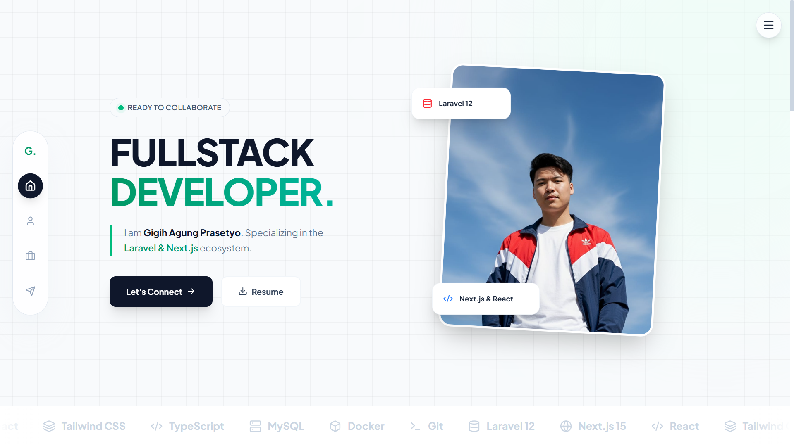
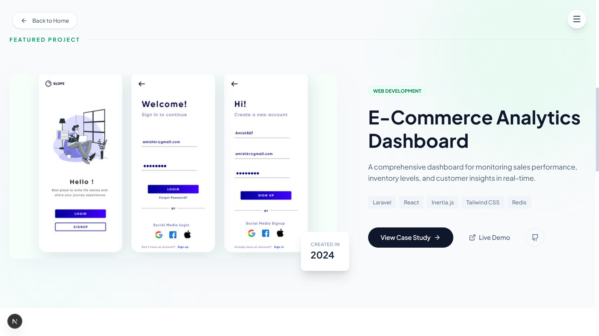
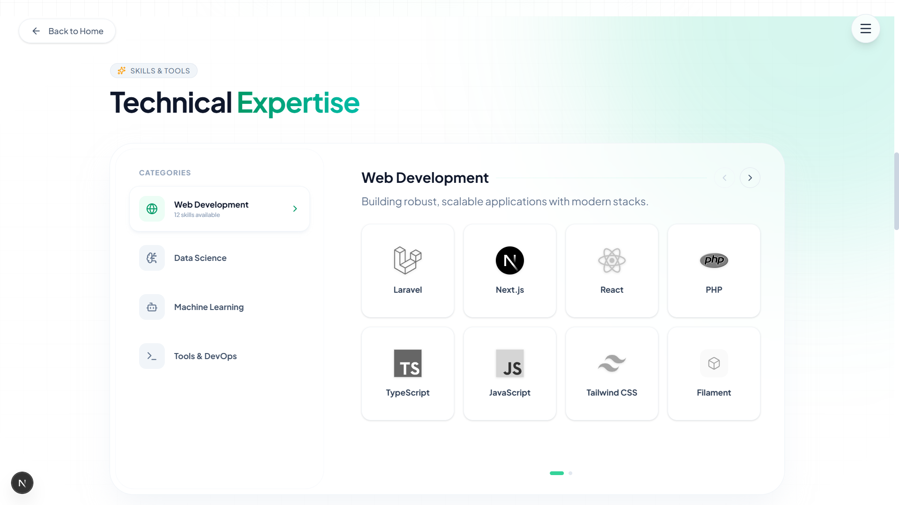

# 🚀 Gigih Agung - Fullstack Portfolio


# 🚀 Gigih Agung - Fullstack Portfolio


A high-performance personal portfolio website built entirely on the **Next.js App Router** ecosystem — frontend, API, and admin CMS all live in a single codebase. Content is managed through a built-in `/admin` panel and stored in **Neon Postgres** via **Prisma**, with photo uploads handled by **Vercel Blob**.

🔗 **Live Site:** [https://portfolio-gigih.vercel.app](https://portfolio-gigih.vercel.app)

---

## 📸 Gallery Preview

Here are some snapshots of the live application across different sections.

### Hero & Introduction
The landing page features a dynamic introduction with smooth entrance animations.
<br>
<a href="https://portfolio-gigih.vercel.app">
  
</a>

### Featured Projects
A curated showcase of selected works with detailed case studies fetched from the database.
<br>
<div style="display: flex; gap: 20px; flex-wrap: wrap;">
  <a href="https://portfolio-gigih.vercel.app#projects" style="flex: 1; min-width: 300px;">
      
  </a>
  <a href="https://portfolio-gigih.vercel.app/about" style="flex: 1; min-width: 300px;">
       
  </a>
</div>

---

## ✨ Key Features

* **⚡ Server-Side Rendering (SSR):** Optimized for SEO and initial load performance using Next.js Server Components.
* **🎨 Modern UI/UX:** Crafted with **Tailwind CSS** and advanced animations using **Framer Motion**.
* **🗄️ Dynamic Content:** All data (projects, experiences, educations, skills, achievements) is fetched in real-time from **Neon Postgres** via **Prisma**.
* **🔐 Built-in Admin CMS:** Full CRUD dashboard at `/admin` — no separate app or repo needed. Protected with **Auth.js (NextAuth v5)** credentials login.
* **🖼️ Image Uploads:** Photos are uploaded directly from the admin panel to **Vercel Blob** storage.
* **📱 Fully Responsive:** Adaptive design ensuring a great experience on Mobile, Tablet, and Desktop.
* **🔒 Type Safety:** Built entirely with robust **TypeScript** configurations.

## 🛠️ Tech Stack

| Category | Technology |
| :--- | :--- |
| **Framework** | Next.js 16 (App Router) |
| **Language** | TypeScript |
| **Styling** | Tailwind CSS |
| **Animation** | Framer Motion |
| **Database** | Neon (Serverless Postgres) |
| **ORM** | Prisma 7 |
| **Auth** | Auth.js (NextAuth v5) |
| **File Storage** | Vercel Blob |
| **CMS/Admin** | Built-in (`/admin`), same codebase |
| **Deployment** | Vercel |

## 🗂️ Project Structure

```
app/
├── (public pages)         → Home, About, Projects, Archive
├── admin/
│   ├── login/             → Admin login (Server Action based)
│   └── (protected)/       → Dashboard: Projects, Experiences,
│                              Educations, Skills, Achievements
└── api/                   → REST-style routes consumed by the admin UI
                              and the public pages (GET is public,
                              write methods require an admin session)

lib/
├── prisma.ts              → Prisma Client singleton (driver adapter)
├── auth.ts                → Auth.js config (credentials provider)
└── mappers.ts             → Maps Prisma models to view-friendly shapes

prisma/
└── schema.prisma          → Database schema (5 models)
```

## ⚙️ Local Development Setup

1. Clone the repo and install dependencies:
   ```bash
   npm install
   ```
2. Copy `.env.example` to `.env` and fill in:
   - `DATABASE_URL` / `DIRECT_URL` — from your [Neon](https://neon.tech) project
   - `ADMIN_EMAIL` / `ADMIN_PASSWORD_HASH` — generate the hash with `bcryptjs`
   - `NEXTAUTH_SECRET` — random string (`openssl rand -base64 32`)
   - `BLOB_READ_WRITE_TOKEN` — from your Vercel Blob store (must be a **Public** store)
3. Push the schema and generate the client:
   ```bash
   npx prisma generate
   npx prisma db push
   ```
4. Run the dev server:
   ```bash
   npm run dev
   ```
5. Visit `http://localhost:3000/admin/login` to manage content.

## 🤝 Contact Me

Feel free to reach out for collaborations or just a friendly chat.

* **Email:** gigihagungprasetyo@gmail.com
* **LinkedIn:** [Gigih Agung Prasetyo](https://www.linkedin.com/in/gigih-agung-prasetyo-092772246/)

---
*Developed by Gigih Agung Prasetyo.*

Feel free to reach out for collaborations or just a friendly chat.

* **Email:** gigihagungprasetyo@gmail.com
* **LinkedIn:** [Gigih Agung Prasetyo](https://www.linkedin.com/in/gigih-agung-prasetyo-092772246/)

---
*Developed by Gigih Agung Prasetyo.*